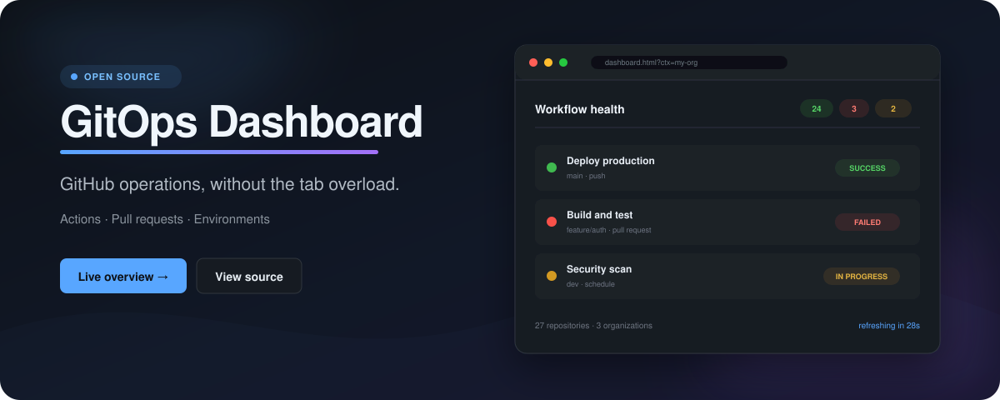

<p align="center">
  <a href="https://agsgimenez.github.io/gitops-dashboard/">
    
  </a>
</p>

<p align="center">
  <strong>Monitor GitHub Actions, review pull requests and manage environments<br>across repositories and organizations—from one browser tab.</strong>
</p>

<p align="center">
  <a href="https://agsgimenez.github.io/gitops-dashboard/"><strong>Live overview</strong></a>
  ·
  <a href="#setup">Setup</a>
  ·
  <a href="#security">Security</a>
  ·
  <a href="https://github.com/agsgimenez/gitops-dashboard/issues">Support</a>
</p>

| ⚡ Workflows | 🔀 Pull requests | 🔐 Environments |
| --- | --- | --- |
| Monitor CI across every configured repo and dispatch manual workflows with their declared inputs. | See live checks, reviewers and merge readiness without opening each repository. | Compare variables and secret names across org, repository and environment scopes. |

> [!NOTE]
> **No backend, build step or install.** GitOps Dashboard runs directly in the
> browser with plain HTML, CSS and JavaScript. It integrates with the GitHub REST
> API and is maintained by a
> [GitHub Developer Program](https://docs.github.com/en/integrations/concepts/github-developer-program)
> member.

## Pages

| File | Role |
| --- | --- |
| `index.html` | Home — PAT setup + workspace switcher |
| `dashboard.html?ctx=<org>` | CI dashboard filtered to selected context |
| `prs.html?ctx=<org>` | PR Board — open PRs with live check runs |
| `env-manager.html?ctx=<org>` | GitHub Environments variable and secret manager |

## Setup

### 1. Clone and configure repos

Copy `config.example.js` to `config.js` and list your repos:

```js
window.CI_CONFIG = {
  repos: [
    "my-org/repo-a",
    "my-org/repo-b",
    "another-org/repo-c",
    "my-user/personal-repo",
  ]
};
```

`config.js` is in `.gitignore` — it is never committed.

### 2. Generate a GitHub PAT

Go to [github.com/settings/tokens](https://github.com/settings/tokens) and create a token with:

| Scope | Required | Used for |
| --- | --- | --- |
| `repo` | ✅ Yes | Read workflows, environments, repo-level and env-level variables/secrets |
| `workflow` | ✅ Yes | Trigger `workflow_dispatch` |
| `admin:org` (read) | ⚠ Optional | Show org-level variables and secrets in the Env Manager. Without it the org section displays a "no access" notice but the rest still works. |

The token is entered once in the UI and stored in your browser's `localStorage`. It is never written to any file.

### 3. Open

Open `index.html` directly in the browser — no server, no `npm install`.

```powershell
start "C:\path\to\gitops-dashboard\index.html"
```

## Features

### Workflow Dashboard

- Workspace switcher: pick an org or user to scope the dashboard; real GitHub avatars load automatically
- Workflows grouped by trigger type (push, PR, manual, schedule) with status chips
- Filter by actor: after data loads a pill row appears with every user who triggered a run — click one to scope the view
- Run history modal — last 10 executions per workflow
- Dispatch: run `workflow_dispatch` workflows with their declared inputs
- Browser notifications: get an OS alert when a running workflow completes (🔔 toggle in header)
- Auto-refresh every 30 seconds

### PR Board

- All open PRs across your repos in one view
- Check runs load progressively in the background — PRs appear immediately
- Filter by status: failing checks / ready to merge / draft / needs review
- Filter by user: pill row shows every author and requested reviewer — select one to see only PRs that involve them
- Shows labels (with real colors), reviewer avatars, and `head → base` branch flow

### Environment Manager

- Environments loaded dynamically from the GitHub API — no hardcoded list
- **Multi-scope view**: variables and secrets shown in three sections — org, repo, and environment — so you see the full effective config, not just one level
- Override indicators (`↑org`, `↑repo`) flag keys that exist at a lower scope and are being overridden
- Variables: visible values, editable directly in the UI (env-level only)
- Secrets: names shown as `••••••`, CLI button generates the `gh secret set` command
- Compare with `.env.example` to detect keys declared in the contract but missing in the environment
- Org-level section requires `admin:org` PAT scope; shows a clear notice if absent

## Security

GitOps Dashboard has no backend. All GitHub API requests run directly from your browser using the PAT you provide.

- Your token is stored in `localStorage` only — never written to files, never sent to any third-party service
- No telemetry, no analytics, no external requests beyond `api.github.com` and `github.com` (avatars)
- Open source — you can read every line before running it
- `workflow_dispatch` is gated by the `workflow` scope; you control which token you create and what scopes you grant
- Secrets values are never fetched — only names are retrieved via the GitHub API

Read the full [security policy](SECURITY.md) for the threat model, safe usage
guidance and private vulnerability reporting instructions.

## Scripts

`scripts/sync-env.sh` uploads a local `.env` file to a GitHub Environment via the `gh` CLI:

```bash
./scripts/sync-env.sh <owner/repo> <environment> [envs-dir]
# Reads  envs/.env.<repo>.<environment>          → gh variable set
# Reads  envs/.env.<repo>.<environment>.secrets   → gh secret set
```

Files in `envs/` are gitignored.

## Support

Open a [GitHub issue](https://github.com/agsgimenez/gitops-dashboard/issues)
or email [gimenezagustin98@hotmail.com](mailto:gimenezagustin98@hotmail.com).

## Project structure

```text
gitops-dashboard/
├── index.html            # Home: PAT setup + workspace switcher
├── dashboard.html        # CI dashboard (?ctx=<org>)
├── prs.html              # PR board (?ctx=<org>)
├── env-manager.html      # Environment manager (?ctx=<org>)
├── config.example.js     # Config template
├── config.js             # Your config (gitignored)
├── scripts/
│   └── sync-env.sh       # Bulk upload vars/secrets via gh CLI
├── envs/                 # Local .env files (gitignored)
├── docs/                 # Public landing page (GitHub Pages)
├── SECURITY.md           # Threat model and vulnerability reporting
├── LICENSE
└── README.md
```

## License

MIT
